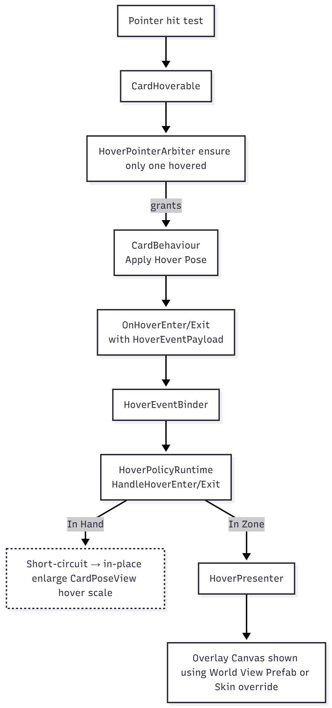

# Card Hand Toolkit — API Hub

> This is the entry point for all public APIs. It outlines core concepts, links to deep‑dive pages, and provides an A–Z reference for every public type.

---

## How to Use This Hub

1. **Start with Concepts** for a mental model.
2. Jump to a **Module** page for systems you’ll extend (Interaction, Zones, Views, Data, Visuals, Layout).
3. Use the **A–Z Index** for quick lookups on specific components and interfaces.

> **Docs style per entry** (used across this repo):
>
> - **Description:** What this type does and when to use it.
> - **Customizable Attributes:** Serialized fields/inspector knobs.
> - **Group Details:** Collaborators & relationships.
> - **Cell Details:** Key methods, events, extension points.
> - **Example:** Minimal code or scene steps.

---

## Table of Contents

- [Concepts](#concepts)
- [Modules Map](#modules-map)
  - [Interaction](API/Interaction.md)
  - [Zones & Play](API/ZonesAndPlay.md)
  - [Views & Presentation](API/Views.md)
  - [Data & Deck](API/DataAndDeck.md)
  - [Visuals & Factories](API/Visuals.md)
  - [Layout](API/Layout.md)
- [A–Z Type Index](#a–z-type-index)
- [FAQ](#faq)

---

## Concepts

> **Goal:** Give you the exact mental model so you can extend safely. This section is concept‑heavy (with diagrams); the A–Z entries stay terse.

### A. Canonical Card Lifecycle (Local Player)

1. **Draw (data‑only):** `Deck` → GUID pulled. `HandStateService.Add(CardRef)` creates/returns a **CardRef** `{instanceId, definitionGuid}`; if the card already exists, `AddExisting` reuses its `instanceId`.
2. **Hand event:** `PlayerHand` listens → **OnCardAdded(CardRef)**.
3. **Scene reuse check:** `SceneCardLookup.TryGet(instanceId)` →

   - **Exists:** parent under `PlayerHand`, set pose → **Normal**.
   - **Missing:** build a new visual via **VisualFactoryLoader.Build(CardRef, drawOrigin)**.

4. **Build pipeline:**

   - **Lookup data:** `CardLibraryLoader.Get(definitionGuid)` → `ScriptableCard`.
   - **Instantiate prefab** for the card.
   - **Initialize view root:** `CardBehaviour.Initialize(ScriptableCard, instanceId)`

     1. registers into `SceneCardLookup`
     2. pushes textures to all `ICardView` (e.g., `Card3DView.SetFrameSpriteByCardRarity`, `SetArtSprite`).

   - **Create ViewModel** via the VM factory (inside the loader/build path).
   - **Presenter init:** `CardPresenter.Initialize(global CardSkin, viewModel)` →

     1. instantiates **World View Prefab** onto the card’s world canvas
     2. binds the prefab’s **ICardViewBinder** to the **ViewModel**
     3. toggles fields using **ViewModel + CardSkin**
     4. calls **Refresh** to fan out updates.

5. **Add to hand:** parented under `PlayerHand`.
6. **Runtime visuals:** `CardPoseView` (an `ICardView` on the view root) applies **face up/down**, **tapped**, and **hover scale** on `CardBehaviour.Refresh`.
7. **Hover/drag ready:** interaction components enabled based on zone (see policy matrix below).
8. **Play action:** crossing **play height** & drop → iterate scene `IPlayResolver`s by **priority** → first `TryResolvePlay` that succeeds removes from `HandStateService` and adds the card to the accepting `ICardZone`.
9. **Zone visuals & overlay:** In zones, hover does **not** enlarge in place; it emits events handled by `HoverPresenter` to show an **overlay canvas** (uses the same World View Prefab unless the global skin provides an overlay override).

> **[Card Life Cycle Diagram Link](Images/CardLifeCycleDiagram.png)**

### B. Sources of Truth (Who owns what?)

- **CardBehaviour** → runtime identity & presentation state: `ScriptableCard`, `instanceId`, pose state (face/tap/hover), references to view root.
- **CardPresenter** → **not** a data owner; it orchestrates **binding & cascade refresh** using `CardSkin + ViewModel`.
- **ViewModel (ICardViewModel)** → structured runtime data for binding; created by the build path.
- **HandStateService** → list of card refs per seat; emits hand events; writes are mirrored by zones via resolvers.
- **SceneCardLookup** → scene‑level map `instanceId → GameObject`.
- **CardVisibilityService** → face‑up/down decisions (global/local knowledge helpers).

### C. Interaction Model (Allowances vs Input)

- **PointerService** (static) abstracts **input backends**: `TryGet(out Pointer)` for both legacy & new Input Systems. Used by **Hands**, **Drag**, **Hover**.
- **InteractionService** evaluates **what’s allowed** for a card given its zone & policy.
- **DefaultInteractionPolicy** encodes:
  - **Hand (local):** hover ✓ / drag ✓ / select (planned)
  - **Opponent hand:** none
  - **Board:** hover ✓ / select ✓ / target ✓ / drag ✗
- Zone changes toggle components (`DragCard`, `CardHoverable`, etc.) accordingly.

### D. Hover Pipeline (Single‑card arbitration)

1. **CardHoverable** detects pointer hit.
2. **HoverPointerArbiter** ensures **only one** hovered card.
3. **CardBehaviour** applies **hover pose**; fires `OnHoverEnter/Exit(HoverEventPayload)`.
4. **HoverEventBinder** forwards to **HoverPolicyRuntime** → **HandleHoverEnter/Exit**.
5. In **hand**: short‑circuits to simple enlarge. In **zones**: `HoverPresenter` shows overlay (uses `HoverAnchor`, `HoverPolicyRuntime` for sizing/placement).

  

### E. Play Resolution Pipeline (Priority‑ordered)

1. **Drag drop past threshold** (not a zone collider).
2. Iterate **IPlayResolver** instances by **priority**; call `TryResolvePlay(cardRef, pointerState)` until one accepts.
3. Resolver updates **HandStateService** (remove from hand) and adds to its **ICardZone**.
4. Zone calls `AlignCard` and updates visuals; interaction components updated per policy.

  

<!-- > **Diagram:** `Images/play-resolution.png` (Drop → Resolvers(prio) → Winner → HandStateService → Zone). -->

### F. Hands are Zones

- `PlayerHand` and `OpponentHand` **implement `ICardZone`** (have zone types, roots, `AddCard/RemoveCard/AlignCard`).
- They primarily act as **layout containers**; **HandStateService** remains the data authority for hand membership.

### G. Operational Loaders (Runtime Utilities)

- **VisualFactoryLoader** builds card visuals + creates ViewModel + kicks Presenter.
- **CardLibraryLoader** resolves `ScriptableCard` by GUID.
- **CardFrameLibraryLoader**, **LayersLoader** provide assets/layers; they’re singletons used at runtime but typically auto‑wired by the Setup Wizard.

### H. Services Map (at a glance)

- **PointerService** — input abstraction (backend‑agnostic).
- **HandStateService** — seat hands & events.
- **SceneCardLookup** — id→GO registry.
- **CardVisibilityService** — face/knowledge helpers.

---

## Modules Map

### Interaction — _(extend here first for custom User Experience)_

- **Deep doc:** [API/Interaction.md](API/Interaction.md)
- Includes: `InteractionService`, `InteractionController`, `IInteractionPolicy`, `DefaultInteractionPolicy`, `IInteractionOverride`/`CardInteractionOverride`, `CardHoverable`, `DragCard`, `HoverPolicyRuntime`, `HoverRoutingPolicy`, `IHoverPresenter`/`HoverPresenter`, `HoverAnchor`, `PointerService`/`IPointerSource`.

### Zones & Play — _(define how/where cards can be played)_

- **Deep doc:** [API/ZonesAndPlay.md](API/ZonesAndPlay.md)
- Includes: `ICardZone`, `IPlayResolver`, `CardZoneTracker`, `PlayerHand`, `OpponentHand`, examples `SingleSlotZone`, `LineBoardZone`.

### Views & Presentation — _(what a card looks like & how it binds data)_

- **Deep doc:** [API/Views.md](API/Views.md)
- Includes: `ICardView`, `CardBehaviour`, `Card3DView`, `CardPoseView`, `CardPresenter` (sealed).

### Data & Deck — _(what a card IS & how it’s stored/drawn)_

- **Deep doc:** [API/DataAndDeck.md](API/DataAndDeck.md)
- Includes: `ScriptableCard`, `CardDatabase`, `Deck`, `DeckList`, `EmptyDeckPolicies`, `HandStateService`.

### Visuals & Factories — _(skins, frames, factories, and loaders)_

- **Deep doc:** [API/Visuals.md](API/Visuals.md)
- Includes: `CardSkin`, `CardColorPalette`, `CardAddons`, `CardVisualFactorySO`, `VisualFactoryLoader`, `CardFrameLibrary`, `CardFrameLibraryLoader`, `CardLibraryLoader`, `LayersLoader`, `CardToolkitLayers`, `ICardViewModel`, `ICardViewBinder`, `IContextualSwitcher`.

### Layout — _(arrangement & fan poses)_

- **Deep doc:** [API/Layout.md](API/Layout.md)
- Includes: `FanLayout`, `FanPose`, `FanLayoutProfile`.

---

## A–Z Type Index

> Legend: **[E]** Extend/Implement • **[C]** Configure (Inspector) • **[L]** Learn-only

### Card3DView **[L]**

**Description:** _TODO_
**Customizable Attributes:** _TODO_
**Group Details:** _TODO_
**Cell Details:** _TODO_
**Example:** _TODO_

### CardAddons **[C]**

**Description:** _TODO_
**Customizable Attributes:** _TODO_
**Group Details:** _TODO_
**Cell Details:** _TODO_
**Example:** _TODO_

### CardBehaviour **[E]**

**Description:** _TODO_
**Customizable Attributes:** _TODO_
**Group Details:** _TODO_
**Cell Details:** _TODO_
**Example:** _TODO_

### CardColorPalette **[C]**

**Description:** _TODO_
**Customizable Attributes:** _TODO_
**Group Details:** _TODO_
**Cell Details:** _TODO_
**Example:** _TODO_

### CardDatabase **[C]**

**Description:** _TODO_
**Customizable Attributes:** _TODO_
**Group Details:** _TODO_
**Cell Details:** _TODO_
**Example:** _TODO_

### CardFrameLibrary **[C]**

**Description:** _TODO_
**Customizable Attributes:** _TODO_
**Group Details:** _TODO_
**Cell Details:** _TODO_
**Example:** _TODO_

### CardFrameLibraryLoader **[C]** _(Operational)_

**Description:** _TODO_
**Customizable Attributes:** _TODO_
**Group Details:** _TODO_
**Cell Details:** _TODO_
**Example:** _Setup Wizard typically adds this._

### CardHoverable **[C]**

**Description:** _TODO_
**Customizable Attributes:** _TODO_
**Group Details:** _TODO_
**Cell Details:** _TODO_
**Example:** _TODO_

### CardLibraryLoader **[C]** _(Operational)_

**Description:** _TODO_
**Customizable Attributes:** _TODO_
**Group Details:** _TODO_
**Cell Details:** _TODO_
**Example:** _Setup Wizard typically adds this._

### CardPoseView **[C]**

**Description:** _TODO_
**Customizable Attributes:** _TODO_
**Group Details:** _TODO_
**Cell Details:** _TODO_
**Example:** _TODO_

### CardPresenter (sealed) **[L]**

**Description:** _TODO_
**Group Details:** _TODO_
**Cell Details:** _Key events/callbacks only_
**Example:** _N/A (sealed)_

### CardSkin **[C]**

**Description:** _TODO_
**Customizable Attributes:** _TODO_
**Group Details:** _TODO_
**Cell Details:** _TODO_
**Example:** _Inspector-focused_

### CardToolkitLayers **[L]** _(Constants)_

**Description:** _Do not modify IDs; used by Setup Wizard and gizmos._
**Customizable Attributes:** _None_
**Group Details:** _TODO_
**Cell Details:** _TODO_
**Example:** _N/A_

### CardVisualFactorySO **[C]**

**Description:** _TODO_
**Customizable Attributes:** _TODO_
**Group Details:** `VisualFactoryLoader`
**Cell Details:** _TODO_
**Example:** _TODO_

### CardZoneTracker **[E]**

**Description:** _TODO_
**Customizable Attributes:** _TODO_
**Group Details:** `ICardZone`, `IPlayResolver`
**Cell Details:** _TODO_
**Example:** _TODO_

### Deck **[E]**

**Description:** _TODO_
**Customizable Attributes:** _N/A_
**Group Details:** `DeckList`, `EmptyDeckPolicies`
**Cell Details:** _Key methods: draw, peek, shuffle…_
**Example:** _TODO_

### DeckList **[C]**

**Description:** _TODO_
**Customizable Attributes:** _TODO_
**Group Details:** `Deck`
**Cell Details:** _TODO_
**Example:** _TODO_

### DefaultInteractionPolicy **[C]**

**Description:** _TODO_
**Customizable Attributes:** _TODO_
**Group Details:** `InteractionService`, `InteractionController`
**Cell Details:** _TODO_
**Example:** _TODO_

### DragCard **[C]**

**Description:** _TODO_
**Customizable Attributes:** _TODO_
**Group Details:** `InteractionController`, `PointerService`
**Cell Details:** _TODO_
**Example:** _TODO_

### EmptyDeckPolicies **[C]**

**Description:** _TODO_
**Customizable Attributes:** _TODO_
**Group Details:** `Deck`
**Cell Details:** _TODO_
**Example:** _TODO_

### FanLayout / FanPose **[C]**

**Description:** _TODO_
**Customizable Attributes:** _TODO_
**Group Details:** `FanLayoutProfile`, `PlayerHand`, `OpponentHand`
**Cell Details:** _TODO_
**Example:** _TODO_

### FanLayoutProfile **[C]**

**Description:** _Profile asset that defines curvature, spacing, etc._
**Customizable Attributes:** _TODO_
**Group Details:** `FanLayout`
**Cell Details:** _TODO_
**Example:** _TODO_

### HandStateService **[L]**

**Description:** _TODO_
**Customizable Attributes:** _N/A_
**Group Details:** `PlayerHand`, `OpponentHand`
**Cell Details:** _Key enums/values_
**Example:** _N/A_

### HandViewBase **[L]**

**Description:** _Shared properties for `PlayerHand` and `OpponentHand`._
**Customizable Attributes:** _List shared props only_
**Group Details:** `FanLayout`
**Cell Details:** _TODO_
**Example:** _N/A_

### HoverAnchor **[C]**

**Description:** _TODO_
**Customizable Attributes:** _TODO_
**Group Details:** `HoverPresenter`
**Cell Details:** _TODO_
**Example:** _TODO_

### HoverPolicyRuntime **[C]**

**Description:** _TODO_
**Customizable Attributes:** _TODO_
**Group Details:** `HoverPresenter`, `CardHoverable`
**Cell Details:** _TODO_
**Example:** _TODO_

### HoverPresenter / IHoverPresenter **[C]/[E]**

**Description:** _TODO_
**Customizable Attributes:** _TODO_
**Group Details:** `HoverAnchor`, `HoverPolicyRuntime`
**Cell Details:** _Interface points & default implementation_
**Example:** _TODO_

### HoverRoutingPolicy **[E]**

**Description:** _TODO_
**Customizable Attributes:** _N/A_
**Group Details:** `HoverPresenter`
**Cell Details:** _TODO_
**Example:** _TODO_

### ICardView **[E]**

**Description:** _TODO_
**Customizable Attributes:** _N/A_
**Group Details:** `CardBehaviour`, `CardPresenter`
**Cell Details:** _Interface members_
**Example:** _Minimal implementation snippet_

### ICardViewBinder **[E]**

**Description:** _TODO_
**Customizable Attributes:** _N/A_
**Group Details:** `ICardViewModel`
**Cell Details:** _Binder hooks_
**Example:** _TODO_

### ICardViewModel **[E]**

**Description:** _TODO_
**Customizable Attributes:** _N/A_
**Group Details:** `ICardViewBinder`, `CardVisualFactorySO`
**Cell Details:** _Model fields_
**Example:** _TODO_

### ICardZone **[E]**

**Description:** _Implement to create board zones._
**Customizable Attributes:** _Varies per concrete zone_
**Group Details:** `IPlayResolver`, `CardZoneTracker`
**Cell Details:** _Required members_
**Example:** _Minimal custom zone snippet_

### IContextualSwitcher **[E]**

**Description:** _TODO_
**Customizable Attributes:** _N/A_
**Group Details:** `ICardViewModel`
**Cell Details:** _Switch rules_
**Example:** _TODO_

### IInteractionOverride / CardInteractionOverride **[E]**

**Description:** _TODO_
**Customizable Attributes:** _N/A_
**Group Details:** `IInteractionPolicy`
**Cell Details:** _Override surface_
**Example:** _TODO_

### IInteractionPolicy **[E]**

**Description:** _TODO_
**Customizable Attributes:** _N/A_
**Group Details:** `InteractionService`
**Cell Details:** _Policy callbacks_
**Example:** _TODO_

### IPlayResolver **[E]**

**Description:** _Resolve whether/where a card can enter a zone._
**Customizable Attributes:** _N/A_
**Group Details:** `ICardZone`
**Cell Details:** _Required members_
**Example:** _Quick example with `SingleSlotZone`_

### InteractionController **[E]**

**Description:** _TODO_
**Customizable Attributes:** _TODO_
**Group Details:** `InteractionService`, `DragCard`
**Cell Details:** _TODO_
**Example:** _TODO_

### InteractionService **[E]**

**Description:** _TODO_
**Customizable Attributes:** _TODO_
**Group Details:** `IInteractionPolicy`, `IInteractionOverride`
**Cell Details:** _TODO_
**Example:** _TODO_

### LayersLoader **[C]** _(Operational)_

**Description:** _Creates/validates required layers._
**Customizable Attributes:** _Usually none_
**Group Details:** `CardToolkitLayers`
**Cell Details:** _TODO_
**Example:** _Setup Wizard adds this._

### LineBoardZone _(example)_ **[L]**

**Description:** _Starter zone; not production-ready._
**Customizable Attributes:** _Few_
**Group Details:** `ICardZone`, `IPlayResolver`
**Cell Details:** _Minimal_
**Example:** _See Zones deep doc_

### OpponentHand **[C]**

**Description:** _TODO_
**Customizable Attributes:** _TODO_
**Group Details:** `HandViewBase`, `FanLayout`
**Cell Details:** _Events_
**Example:** _TODO_

### PlayerHand **[C]**

**Description:** _TODO_
**Customizable Attributes:** _TODO_
**Group Details:** `HandViewBase`, `FanLayout`
**Cell Details:** _Events_
**Example:** _TODO_

### PointerService / IPointerSource **[L]/[E]**

**Description:** _Abstraction over legacy vs new input systems; implement custom `IPointerSource` if needed._
**Customizable Attributes:** _N/A_
**Group Details:** `DragCard`, `InteractionController`
**Cell Details:** _`TryGet(out Pointer)`_
**Example:** _Custom input source snippet_

### ScriptableCard **[C]**

**Description:** _TODO_
**Customizable Attributes:** _Fields for name, art, cost, etc._
**Group Details:** `CardDatabase`
**Cell Details:** _TODO_
**Example:** _Inspector-focused_

### SingleSlotZone _(example)_ **[L]**

**Description:** _Starter zone; not production-ready._
**Customizable Attributes:** _Few_
**Group Details:** `ICardZone`, `IPlayResolver`
**Cell Details:** _Minimal_
**Example:** _See Zones deep doc_

### VisualFactoryLoader **[C]**

**Description:** _Scene singleton providing `ICardVisualFactory`._
**Customizable Attributes:** _`visualFactory` reference_
**Group Details:** `CardVisualFactorySO`
**Cell Details:** _`IsReady`, boot checks_
**Example:** _Scene setup steps_

---

## FAQ

**Q: Which pages should I read first?**
A: Start with **Interaction** (how players touch cards) and **Zones & Play** (where cards can go). Then skim **Views** to understand binding.

**Q: What’s safe to modify?**
A: Anything tagged **[C]** is intended for configuration. Types tagged **[E]** are designed for extension via interfaces/policies. Types tagged **[L]** are primarily informational.

**Q: Do I have to use the example zones?**
A: No. They’re teaching tools. Implement your own `ICardZone` + `IPlayResolver` for production.

---

> **Next:** Dive into a module: [Interaction](API/Interaction.md) • [Zones & Play](API/ZonesAndPlay.md) • [Views](API/Views.md) • [Data & Deck](API/DataAndDeck.md) • [Visuals](API/Visuals.md) • [Layout](API/Layout.md)
