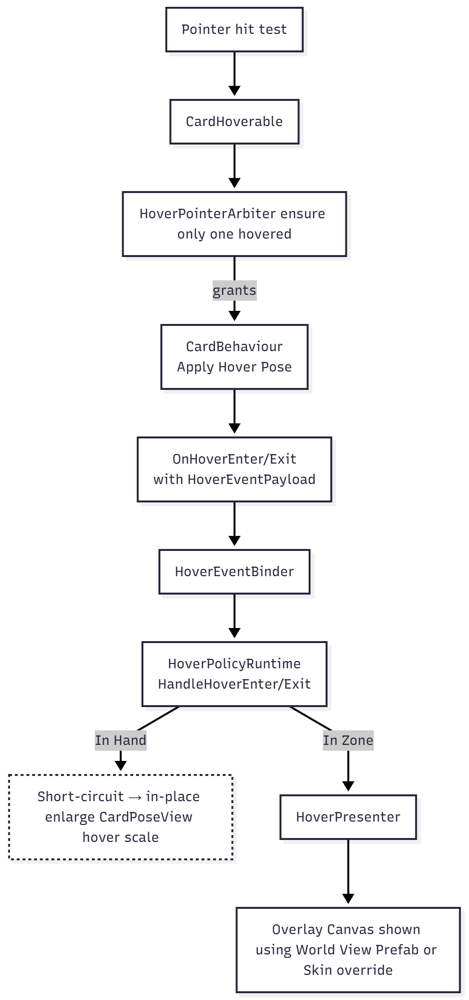
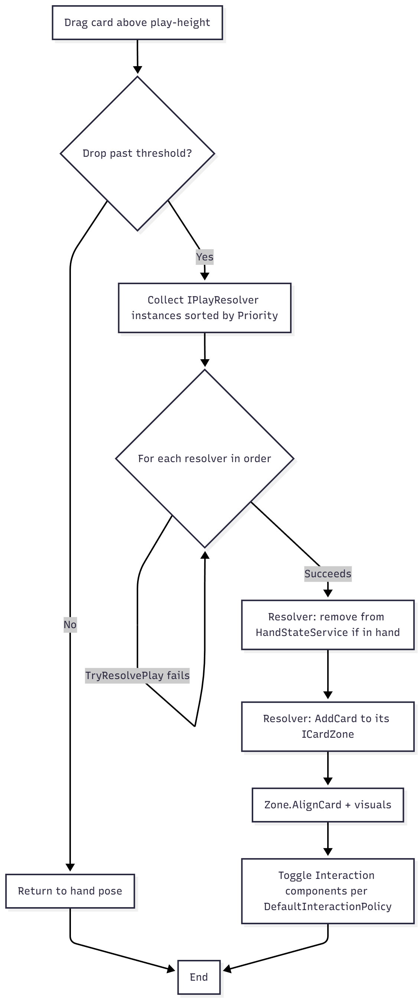

# Concepts

> **Goal:** Give you the exact mental model so you can extend safely. This section is concept‑heavy (with diagrams); the A–Z entries stay terse.

### A. Canonical Card Lifecycle (Local Player)

1. **Draw (data‑only):** `Deck` → GUID pulled. `HandStateService.Add(CardRef)` creates/returns a **CardRef** `{instanceId, definitionGuid}`; if the card already exists, `AddExisting` reuses its `instanceId`.
2. **Hand event:** `PlayerHand` listens → **OnCardAdded(CardRef)**.
3. **Scene reuse check:** `SceneCardLookup.TryGet(instanceId)` →

   - **Exists:** parent under `PlayerHand`, set pose → **Normal**.
   - **Missing:** build a new visual via **VisualFactoryLoader.Build(CardRef, drawOrigin)**.

4. **Build pipeline:**

   - **Lookup data:** `CardLibraryLoader.Get(definitionGuid)` → `ScriptableCard`.
   - **Instantiate prefab** for the card.
   - **Initialize view root:** `CardBehaviour.Initialize(ScriptableCard, instanceId)`

     1. registers into `SceneCardLookup`
     2. pushes textures to all `ICardView` (e.g., `Card3DView.SetFrameSpriteByCardRarity`, `SetArtSprite`).

   - **Create ViewModel** via the VM factory (inside the loader/build path).
   - **Presenter init:** `CardPresenter.Initialize(global CardSkin, viewModel)` →

     1. instantiates **World View Prefab** onto the card’s world canvas
     2. binds the prefab’s **ICardViewBinder** to the **ViewModel**
     3. toggles fields using **ViewModel + CardSkin**
     4. calls **Refresh** to fan out updates.

5. **Add to hand:** parented under `PlayerHand`.
6. **Runtime visuals:** `CardPoseView` (an `ICardView` on the view root) applies **face up/down**, **tapped**, and **hover scale** on `CardBehaviour.Refresh`.
7. **Hover/drag ready:** interaction components enabled based on zone (see policy matrix below).
8. **Play action:** crossing **play height** & drop → iterate scene `IPlayResolver`s by **priority** → first `TryResolvePlay` that succeeds removes from `HandStateService` and adds the card to the accepting `ICardZone`.
9. **Zone visuals & overlay:** In zones, hover does **not** enlarge in place; it emits events handled by `HoverPresenter` to show an **overlay canvas** (uses the same World View Prefab unless the global skin provides an overlay override).

> **[Card Life Cycle Diagram Link](Images/CardLifeCycleDiagram.png)**

### B. Sources of Truth (Who owns what?)

- **CardBehaviour** → runtime identity & presentation state: `ScriptableCard`, `instanceId`, pose state (face/tap/hover), references to view root.
- **CardPresenter** → **not** a data owner; it orchestrates **binding & cascade refresh** using `CardSkin + ViewModel`.
- **ViewModel (ICardViewModel)** → structured runtime data for binding; created by the build path.
- **HandStateService** → list of card refs per seat; emits hand events; writes are mirrored by zones via resolvers.
- **SceneCardLookup** → scene‑level map `instanceId → GameObject`.
- **CardVisibilityService** → face‑up/down decisions (global/local knowledge helpers).

### C. Interaction Model (Allowances vs Input)

- **PointerService** (static) abstracts **input backends**: `TryGet(out Pointer)` for both legacy & new Input Systems. Used by **Hands**, **Drag**, **Hover**.
- **InteractionService** evaluates **what’s allowed** for a card given its zone & policy.
- **DefaultInteractionPolicy** encodes:
  - **Hand (local):** hover ✓ / drag ✓ / select (planned)
  - **Opponent hand:** none
  - **Board:** hover ✓ / select ✓ / target ✓ / drag ✗
- Zone changes toggle components (`DragCard`, `CardHoverable`, etc.) accordingly.

### D. Hover Pipeline (Single‑card arbitration)

1. **CardHoverable** detects pointer hit.
2. **HoverPointerArbiter** ensures **only one** hovered card.
3. **CardBehaviour** applies **hover pose**; fires `OnHoverEnter/Exit(HoverEventPayload)`.
4. **HoverEventBinder** forwards to **HoverPolicyRuntime** → **HandleHoverEnter/Exit**.
5. In **hand**: short‑circuits to simple enlarge. In **zones**: `HoverPresenter` shows overlay (uses `HoverAnchor`, `HoverPolicyRuntime` for sizing/placement).

  

### E. Play Resolution Pipeline (Priority‑ordered)

1. **Drag drop past threshold** (not a zone collider).
2. Iterate **IPlayResolver** instances by **priority**; call `TryResolvePlay(cardRef, pointerState)` until one accepts.
3. Resolver updates **HandStateService** (remove from hand) and adds to its **ICardZone**.
4. Zone calls `AlignCard` and updates visuals; interaction components updated per policy.

  

<!-- > **Diagram:** `Images/play-resolution.png` (Drop → Resolvers(prio) → Winner → HandStateService → Zone). -->

### F. Hands are Zones

- `PlayerHand` and `OpponentHand` **implement `ICardZone`** (have zone types, roots, `AddCard/RemoveCard/AlignCard`).
- They primarily act as **layout containers**; **HandStateService** remains the data authority for hand membership.

### G. Operational Loaders (Runtime Utilities)

- **VisualFactoryLoader** builds card visuals + creates ViewModel + kicks Presenter.
- **CardLibraryLoader** resolves `ScriptableCard` by GUID.
- **CardFrameLibraryLoader**, **LayersLoader** provide assets/layers; they’re singletons used at runtime but typically auto‑wired by the Setup Wizard.

### H. Services Map (at a glance)

- **PointerService** — input abstraction (backend‑agnostic).
- **HandStateService** — seat hands & events.
- **SceneCardLookup** — id→GO registry.
- **CardVisibilityService** — face/knowledge helpers.
